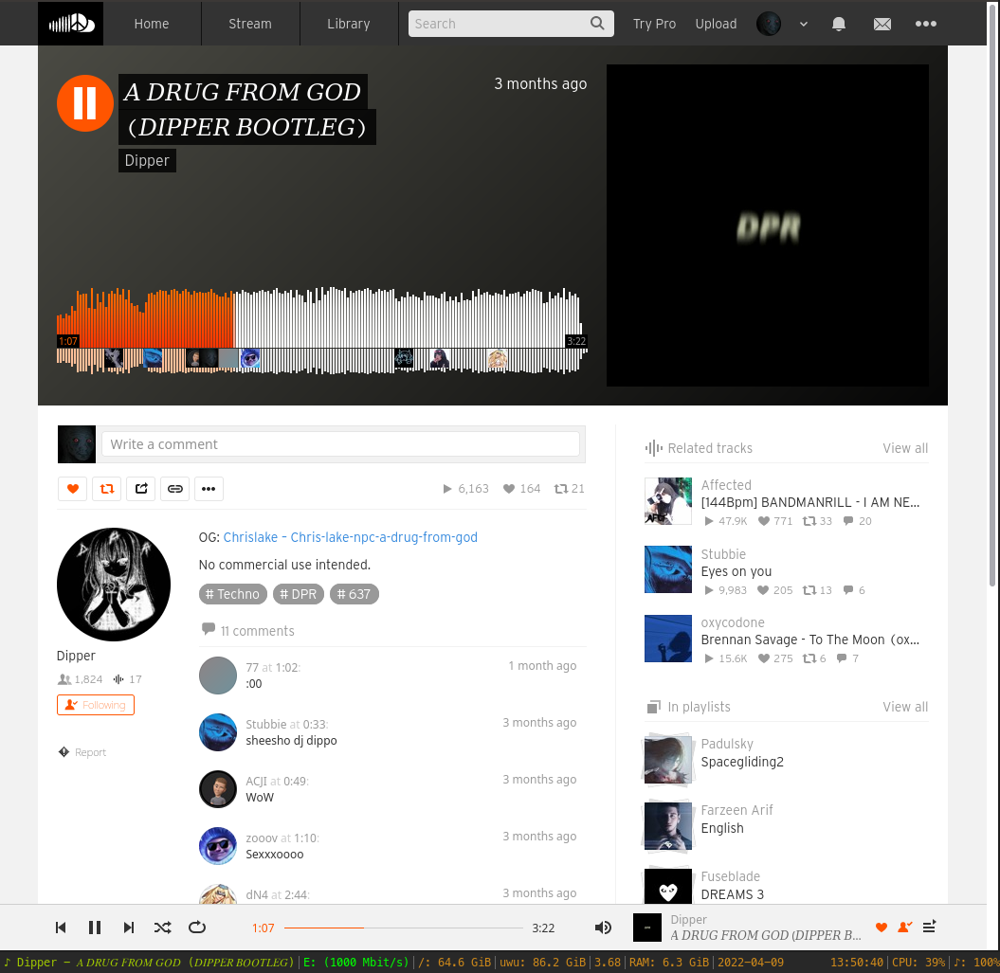

# i3currentMedia


Screenshot of the script working with SoundCloud

### About:
i3currentMedia is a fork from [@rpieja's i3spotifystatus](https://github.com/rpieja/i3spotifystatus) which i recommend to check it out, that uses `playerctl` to get the current media playing from any source, not only spotify, made for myself but it might be what someone else wants.

i3currentMedia is a tiny python script that parses JSON outputed by i3status, adds information about song author and title and outputs it to i3bar.

### What you'll need:
- **playerctl** if you are on an Arch based distro you can get it with:
	`sudo pacman -S playerctl`
- **python** which you problably already have 

### How to install:

* clone repository to your prefered location
* in your i3 config file (usually placed in ~/.config/i3/) set `status_command` to `i3status | /path/to/your/pystatus.py` in `bar` section, like this:

```
bar {
    status_command i3status | ~/.local/scripts/i3currentMedia/pystatus.py
}
```

If you are using i3-gaps, it will probably contain the `status_command i3status` already. You just have to add the pipe and the python script path after. 

* in `i3status.conf` file (create one if you don't have any -> read i3status doc for more information) set `output_format = "i3bar"` inside the 'general' configuration, like this:

```
general {
    ...
    output_format = "i3bar"
    ...
}
```

* Reload i3 configs (usually `Mod + Shift + R`, if you haven't changed it).

Tip: If you are not sure how this whole thing works, you can comment your config files using `#` at the beginning of each line. This way it is easy to revert the changes.

### Credits:
Almost everything made by [@rpieja](https://github.com/rpieja/) i just modified some parts


Script is based on sample wrapper commited on original i3status repository.

